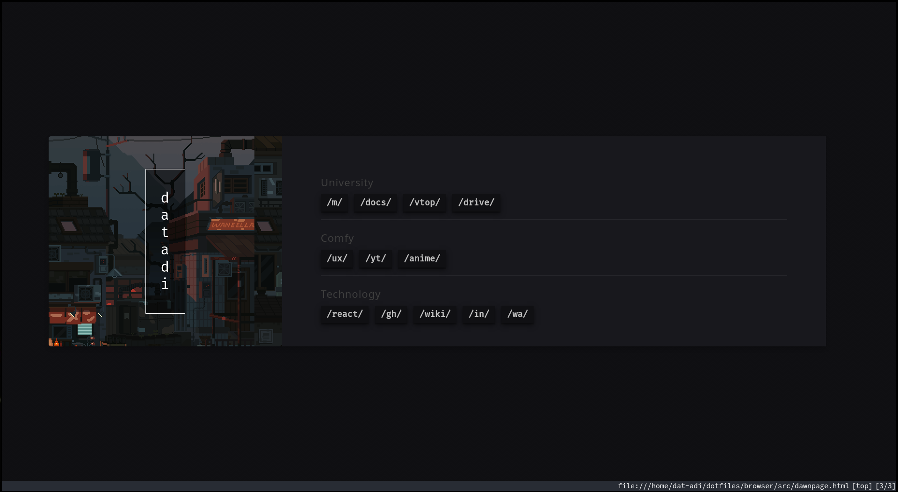

# Config Notes
A repository to contain the configuration files of my editors, and settings of the IDEs as well. Maybe a bit more.

## 27/06/2020
It really only just contains my configurations of my .vimrc, and maybe I'll add in my emacs config once I get the hang of it as well.

## 19/04/2021
I've converted to Arch Linux.

I've connected bunch of my files required for my configuration into this repository.
At this point, the config consists of a large number of applications, and software, ranging from fish to vim, to tmux, to qtile, to DOOM Emacs.

I can probably say that it wouldn't be too much of a hassle to get my setup back, on a new computer of Arch Linux, with a simple git pull and configure using symlinks at this point.

## 30/04/2021
Discovered [dotbot](https://github.com/anishathalye/dotbot#getting-started).
My setup only continues to be easier to set up.

At this point, all I need to do in order to set myself back up, would be a simple few lines.

```shell
git clone git@github.com:dat-adi/dotfiles.git
cd dotfiles
./install
```

That's it!
Just three lines to get back a setup worth of config files, efficiency!

## 07/05/2021
Managed to modularize the qtile config files, splitting up the code into separate Managers for each section.\
Added [starship](https://starship.rs) as my cross-shell prompt, for uniformity in the different shells.\
Installed [colorscripts](https://aur.archlinux.org/packages/shell-color-scripts/), enabled them on startup for fun, and added Hollow Knight ASCII art to startup_scripts for [fm6000](https://github.com/anhsirk0/fetch-master-6000) as well. Might work on it later.

Added Rust replacements for various features related to command line.
- [Alacritty](https://github.com/alacritty/alacritty) : Terminal.
- [Starship](https://starship.rs) : Cross-shell Prompt.
- [Bat](https://github.com/sharkdp/bat) : Replacement for the `cat` command.
- [Exa](https://github.com/ogham/exa) : Replacement for the `ls` command.
- [Ripgrep](https://github.com/BurntSushi/ripgrep) : Replacement for the `grep` command.
- [Procs](https://github.com/dalance/procs) : Replacement for the `ps` command.

Finally, used the [.bash_profile](https://github.com/dat-adi/dotfiles/blob/master/bash_profile) file in order to split up the [.bashrc](https://github.com/dat-adi/dotfiles/blob/master/bashrc) into separate files.\
Helps in keeping it clean with a separate files for [functions](https://github.com/dat-adi/dotfiles/blob/master/.functions) and [aliases](https://github.com/dat-adi/dotfiles/blob/master/.bash_aliases).

I suppose this update arc could be considered to be focused on Modularization and Rust replacements.

## 19/05/2021
I've set up a new homepage for my browser, which is, [qutebrowser](https://qutebrowser.org/).\
It has been inspired from, and is a condensed down version of the [dawn](https://github.com/b-coimbra/dawn) homepage by b-coimbra.\
While I did set out making one for myself, I really did like the dawn version, so, it's just a simpler version of it.

[]("https://github.com/dat-adi/dotfiles/blob/master/browser/src/")

The required assets for the homepage are present in the `browser` directory, in the case that you wish to implement them in your browser as well.\
Along with that, I've also placed all the packages that I use in the `packages.txt`, still need to sort it out into Pacman specific and AUR specific packages.

**Keep in mind that these commands are DANGEROUS**
Setting up all the required dependencies for my Arch Linux configuration can now be done with a simple shell script, that takes care of the pacman packages.\
This record will be updated in the case that I manage to make a version for the `yay` packages as well.

Here's the recovery configuration,

```shell
git clone git@github.com:dat-adi/dotfiles.git
cd dotfiles
./pac-packages
./install
```

That should get you to a working system setup without an issue.\
If the scripts do not execute, check if you've given it permissions to act as an executable in the first place.\
Use `chmod 755 filename` in this case.

---
<p align="right"><i>dat-adi</i></p>
